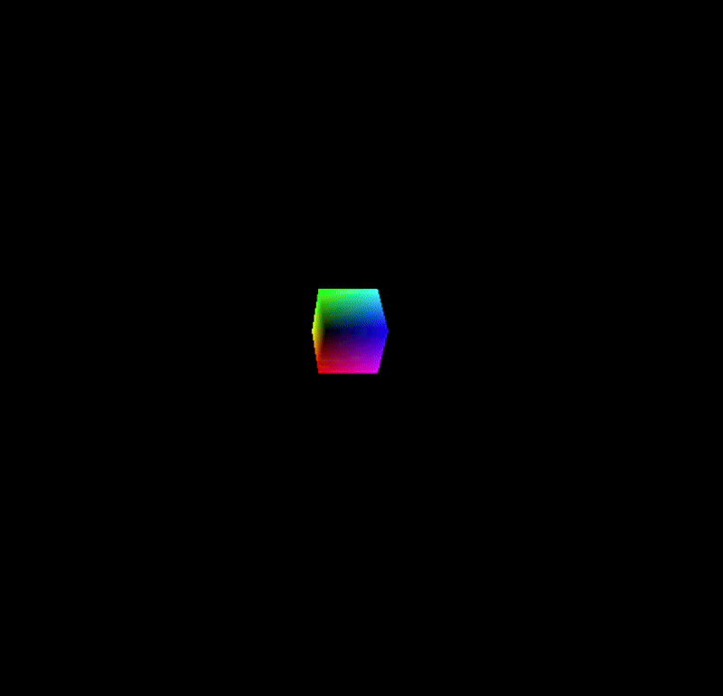
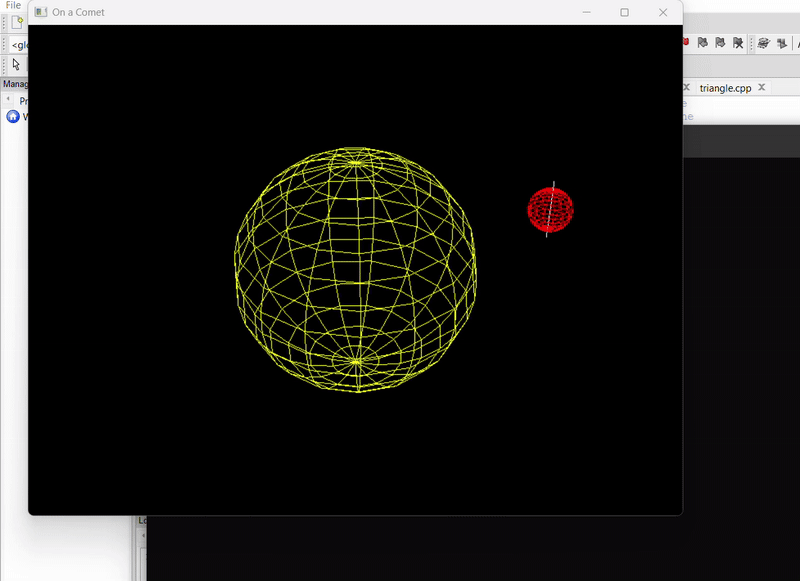
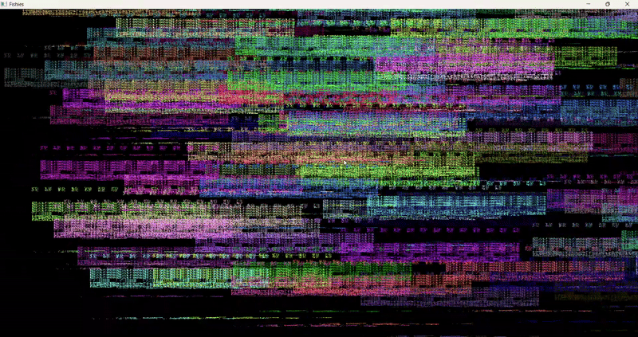
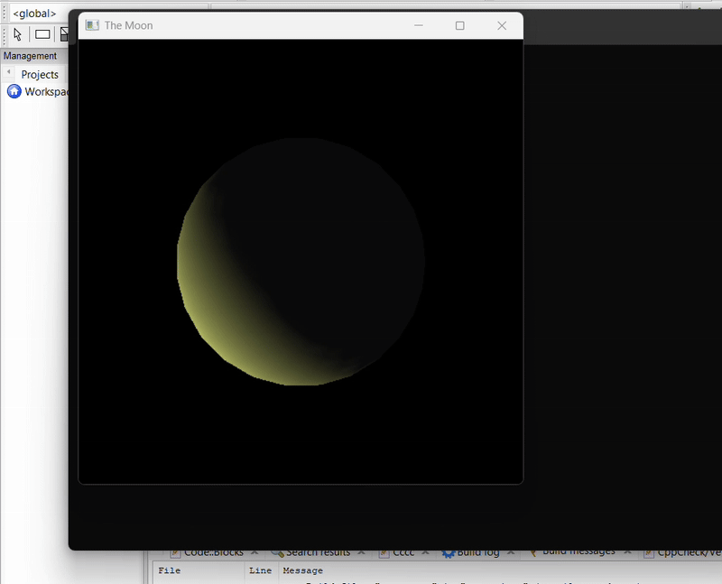
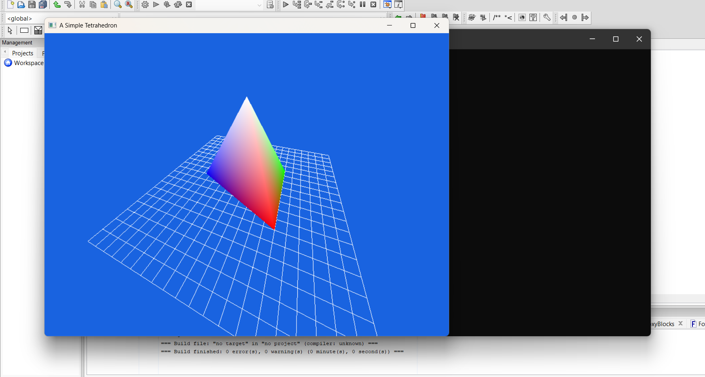
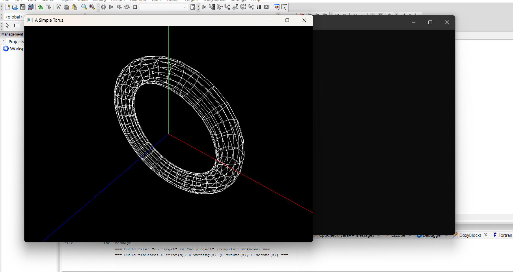

# CppOpenGL

## 📁 Files
- [Program : colorcube.cpp](./colorcube.cpp)
  

  
  

- [Program : 3dcube.cpp](./3dcube.cpp)
  

  
  

- [Program : cometring.cpp](./cometring.cpp)
  

  
  

- [Program : fishbitmap.cpp](./fishbitmap.cpp)
  

  
  

- [Program : phasesmoon.cpp](./phasesmoon.cpp)
  

  
  

- [Program : tetrahedron.cpp](./tetrahedron.cpp)
  

  
  

- [Program : torus.cpp](./torus.cpp)
  

  
  

- [Program : bouncingball.cpp](./bouncingball.cpp)
  

    
    
    
  

- ...
